# AWS Multi-Tier Architecture Deployment with Bastion Host and NAT Gateway

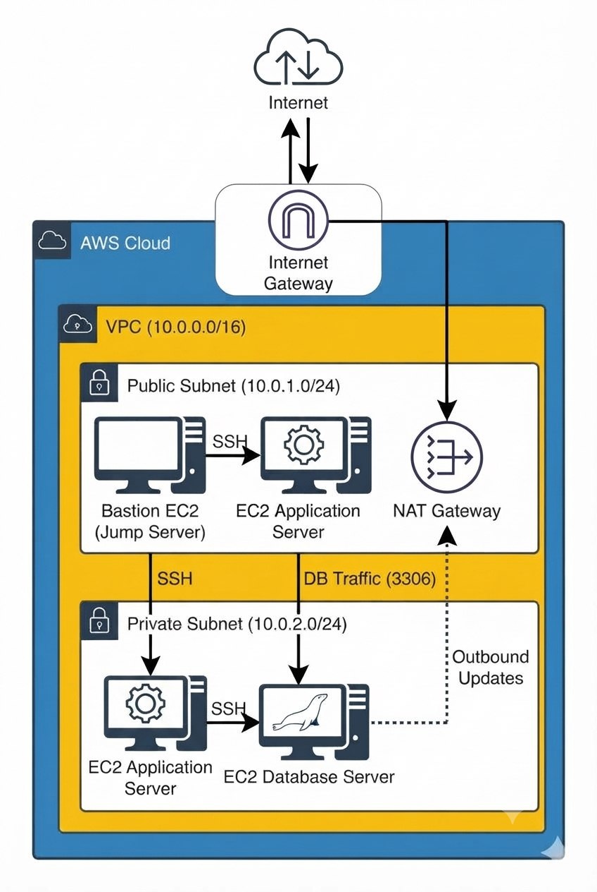

## 1. Objective

The goal of this project is to deploy a **secure, highly available WordPress application on AWS** using a multi-tier architecture. The web/application servers and the database are placed in **private subnets**, with only the Application Load Balancer and the Bastion Host (Jump Server) exposed in the public subnets. This keeps sensitive infrastructure away from direct internet exposure.

### Key Features

- **Bastion Host (Jump Server):** the only SSH entry point for administrative access.
- **Multi-Tier Design:** Presentation tier (ALB), Application tier (EC2 + Apache + PHP) and Data tier (Amazon RDS MySQL).
- **Multi-AZ Networking:** 6 subnets across `us-east-1a` and `us-east-1b` (2 public, 4 private).
- **NAT Gateway:** lets private instances download packages and updates without being reachable from the internet.
- **Application Load Balancer + Target Group:** the public entry point for WordPress traffic.
- **Managed Database:** Amazon RDS MySQL inside a dedicated DB subnet group.
- **Least-Privilege Security Groups:** each tier only accepts traffic from the tier in front of it.

---

## 2. Architecture Overview

### Network Flow

```
Internet <-> Internet Gateway <-> VPC
   Users  -> ALB (public)  -> WordPress EC2 (private)  -> RDS MySQL (private)
   Admin  -> Bastion Host (public) -> SSH -> private EC2 instances
   Private instances -> NAT Gateway (public) -> Internet Gateway (outbound updates only)
```

| Tier | Placement | Purpose |
|------|-----------|---------|
| Bastion Host | Public subnet | SSH entry point for administration |
| Application Load Balancer | Public subnets (2 AZs) | Receives HTTP traffic from the internet |
| NAT Gateway | Public subnet (with Elastic IP) | Outbound internet for private subnets |
| WordPress Web Server | Private subnet | Apache + PHP, reached only via the ALB |
| RDS MySQL | Private subnet (DB subnet group) | WordPress database, no public access |

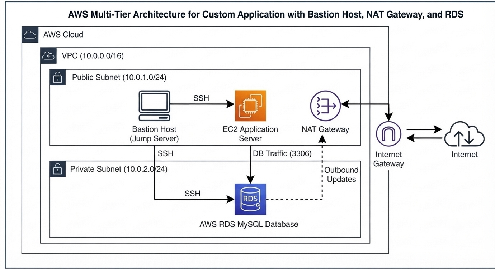

---

## 3. Infrastructure Setup

### Step 1: VPC and Networking Resources

The VPC (`my-project-vpc`, CIDR `10.0.0.0/16`) was created with 2 public subnets, 4 private subnets, an Internet Gateway, a NAT Gateway and an S3 gateway endpoint. The resource map below shows how everything is connected.

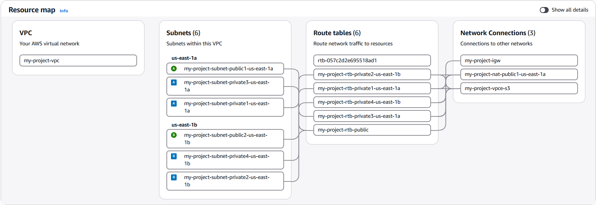

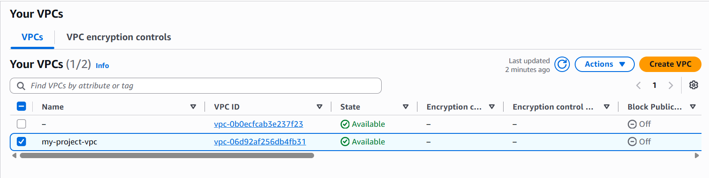

### Step 2: Subnets

| Subnet | AZ | Type |
|--------|----|------|
| `my-project-subnet-public1-us-east-1a` | us-east-1a | Public |
| `my-project-subnet-public2-us-east-1b` | us-east-1b | Public |
| `my-project-subnet-private1-us-east-1a` | us-east-1a | Private |
| `my-project-subnet-private2-us-east-1b` | us-east-1b | Private |
| `my-project-subnet-private3-us-east-1a` | us-east-1a | Private |
| `my-project-subnet-private4-us-east-1b` | us-east-1b | Private |

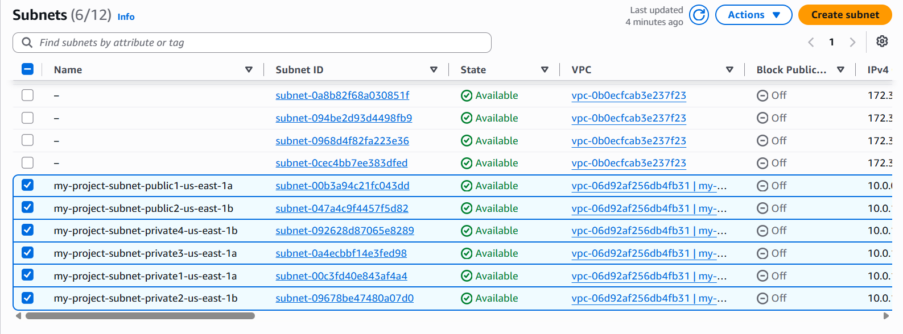

### Step 3: Internet Gateway

`my-project-igw` is attached to `my-project-vpc` and provides internet access for the public subnets.

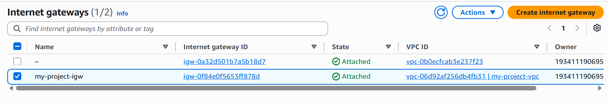

### Step 4: Route Tables

- **`my-project-rtb-public`**: `0.0.0.0/0 -> my-project-igw`, associated with both public subnets.
- **`my-project-rtb-private1` to `private4`**: one per private subnet, with `0.0.0.0/0 -> NAT Gateway` so private instances can reach the internet for updates only.

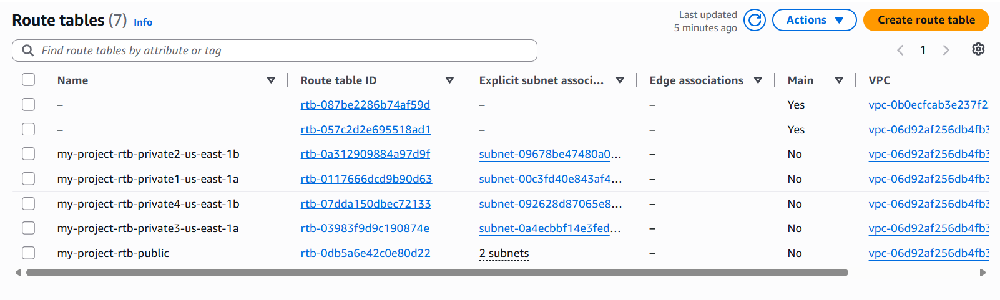

### Step 5: NAT Gateway

`my-project-nat-public1-us-east-1a` was created in the public subnet with an Elastic IP, and the private route tables point their default route to it.

### Step 6: Security Groups

| Security Group | Inbound Rule | Source |
|----------------|--------------|--------|
| `sg bastion` | SSH (22) | Your public IP (`/32`) |
| `sg_alb` | HTTP (80) | `0.0.0.0/0` |
| `sg_app` | HTTP (80) | `sg_alb` |
| `sg_app` | SSH (22) | `sg bastion` |
| `sg_db` | MySQL/Aurora (3306) | `sg_app` (and `sg bastion` for admin access) |

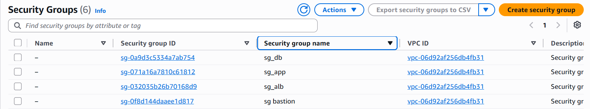

---

## 4. Compute and Database

### Step 7: Launch EC2 Instances

**General specs:** Amazon Linux 2023, `t3.micro`, key pair `my-project-key.pem`.

| Instance | Subnet | Public IP | Security Group |
|----------|--------|-----------|----------------|
| `Bastion-Host` | Public | Enabled | `sg bastion` |
| `Web-Server` | Private | Disabled | `sg_app` |

Bastion Host launched:

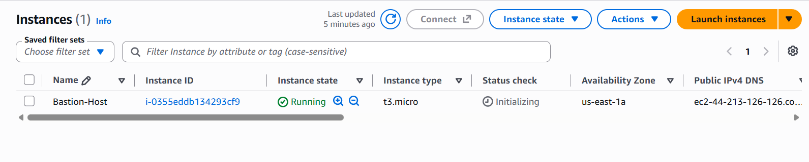

### Step 8: Amazon RDS (MySQL)

First, a **DB subnet group** (`my-project-db-subnet-group`) was created using the private subnets, so the database stays off the public network.

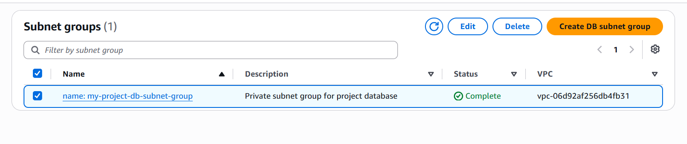

Then the RDS MySQL instance `my-project-db` (`db.t4g.micro`) was launched with **Public access: No** and `sg_db` attached.

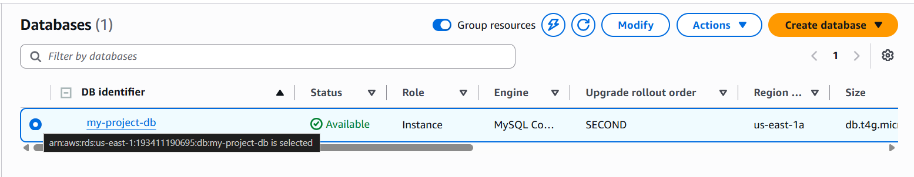

Both EC2 instances running (Web-Server has no public IPv4 address, as intended):

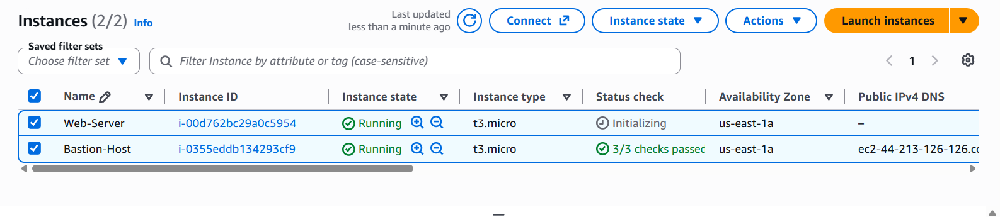

---

## 5. Deployment and Configuration

### Step 9: SSH Access Flow

Connect from your machine to the Bastion Host, then hop to the private Web Server.

**1. Connect to the Bastion Host**

```bash
ssh -i my-project-key.pem ec2-user@<BASTION_PUBLIC_IP>
```

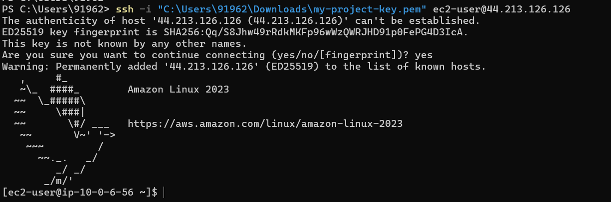

**2. From the Bastion to the private Web Server**

```bash
ssh ec2-user@<WEB_SERVER_PRIVATE_IP>
```

> Tip: use SSH agent forwarding (`ssh -A -i my-project-key.pem ...`) so the private key never has to be copied onto the Bastion Host.

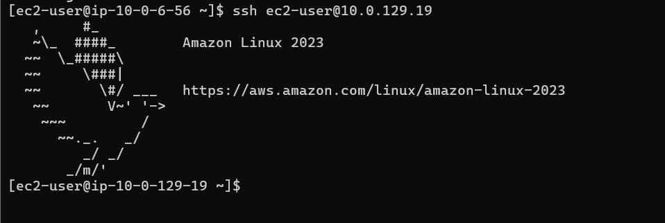

### Step 10: Database Setup

From the Web Server (or Bastion), install the MySQL client and connect to RDS:

```bash
sudo dnf install mariadb105 -y
mysql -h <RDS_ENDPOINT> -u <DB_ADMIN_USER> -p
```

Create the WordPress database:

```sql
CREATE DATABASE wordpress;
SHOW DATABASES;
```

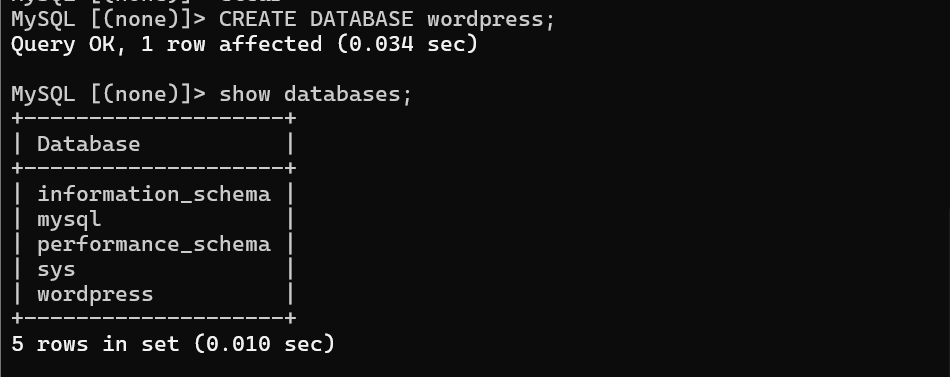

### Step 11: WordPress Installation (Private Web Server)

**1. Install packages**

```bash
sudo dnf update -y
sudo dnf install httpd php php-mysqlnd wget unzip -y
sudo systemctl start httpd && sudo systemctl enable httpd
```

**2. Download WordPress**

```bash
cd /var/www/html
sudo wget https://wordpress.org/latest.zip
sudo unzip latest.zip
sudo cp -r wordpress/* /var/www/html/
sudo chown -R apache:apache /var/www/html
```

**3. Configure WordPress**

```bash
sudo cp wp-config-sample.php wp-config.php
sudo vi wp-config.php
# Update DB_NAME (wordpress), DB_USER, DB_PASSWORD and DB_HOST (RDS endpoint)
```

> Never commit real passwords to GitHub. Use strong credentials in practice.

### Step 12: Target Group and Application Load Balancer

A target group `tg-wordpress` (HTTP, port 80, target type: Instance) was created and the Web Server registered as a target. An internet-facing **Application Load Balancer** (`alb-wordpress`) in the public subnets, using `sg_alb`, forwards HTTP traffic to this target group.

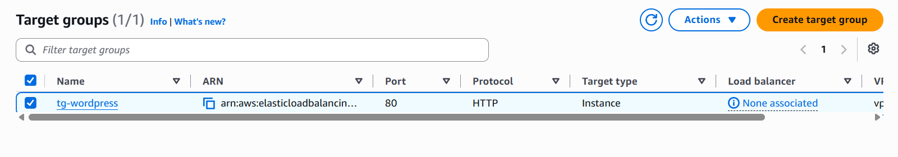

### Step 13: Final Access

Open the ALB DNS name in a browser to complete the WordPress setup:

```
http://<ALB_DNS_NAME>
```

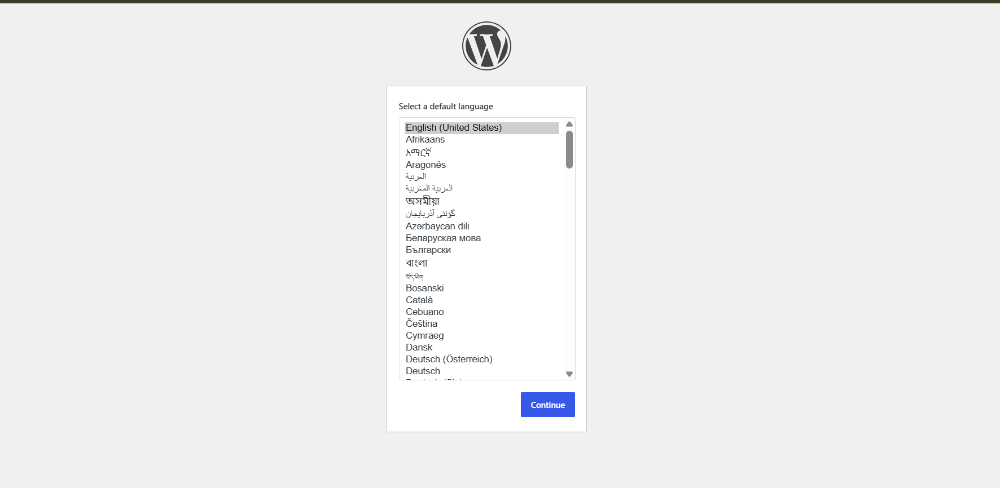

After installation, the WordPress admin dashboard is reachable through the load balancer (`/wp-admin`):

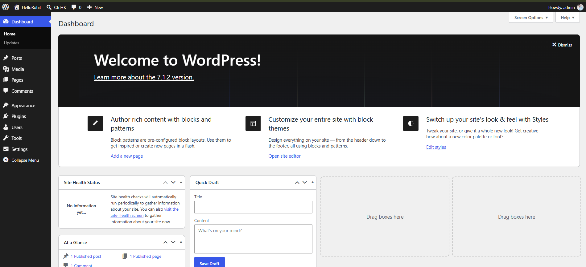

---

## 6. Results

- WordPress runs on a **private** EC2 instance with no public IP.
- The database runs on **RDS in private subnets**, reachable only from the application tier.
- Administrative SSH access goes only through the **Bastion Host**.
- Private instances reach the internet through the **NAT Gateway** but cannot be reached from it.
- Public traffic enters only through the **Application Load Balancer**.

## 7. Cleanup

To avoid charges, delete resources in this order: ALB and target group, EC2 instances, RDS instance and DB subnet group, NAT Gateway, release the Elastic IP, Internet Gateway, subnets, route tables, security groups, and finally the VPC.

## 8. Technologies Used

AWS VPC, EC2, RDS (MySQL), Application Load Balancer, NAT Gateway, Internet Gateway, Security Groups, Amazon Linux 2023, Apache, PHP, WordPress

## Author

**Rohit Pawar**
GitHub: [@rohitpawargithub](https://github.com/rohitpawargithub)
